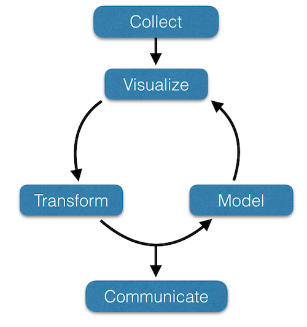

--- 
title: "Environmental Data Literacy"
author: "Rodney J. Dyer"
address: "Center for Environmental Studies, VCU Life Sciences"
description: "A textbook for the use of R in environmental statistics."
site: bookdown::bookdown_site
output: bookdown::gitbook
documentclass: book
bibliography: 
biblio-style: apalike
link-citations: yes
github-repo: "dyerlab/applied_environmental_statisics"
---


# Frontmatter {- .white_letters}


```{r setup, include=FALSE}
knitr::opts_chunk$set(echo = TRUE, 
                      fig.align = "center", fig.width = 6, fig.height=5,
                      warning=FALSE, error=FALSE)
library( ggplot2 )
theme_set( theme_bw() )

```





This textbook was designed in support of the basic graduate level course in Ecological Data Literacytaught to incoming graduate students in the [Center for Environmental Studies](http://ces.vcu.edu) at [Virginia Commonwealth University](http://www.vcu.edu).  

Build Date: **`r date()`**

The content of this text is modified, added to, and changed continually in support of this class.  You are welcome to use the content of this book in its present form and you can provide feedback, comments, or suggestions for additions by contacting me at [rjdyer@vcu.edu](mailto://rjdyer@vcu.edu).  This work will continue to be hosted online and continually updated as new approaches and applications become available.

&copy; 2017 by R.J. Dyer.

<a rel="license" href="http://creativecommons.org/licenses/by-sa/4.0/"></a><br />This work is licensed under a <a rel="license" href="http://creativecommons.org/licenses/by-sa/4.0/">Creative Commons Attribution-ShareAlike 4.0 International License</a>.  Under this license, authorized individuals may copy, distribute, display and perform the work and make derivative works and remixes based on this text only if they give the original author credit (attribution).  You are also free to distribute derivative works only under a license identical ("not more restrictive") to the license that governs this original work. 

Dr. Rodney Dyer is a Professor and Director for the [Center for Environmental Studies](http://ces.vcu.edu) at [Virginia Commonwealth University](http://www.vcu.edu) in Richmond, Virginia, USA.  His research focuses on genetic connectivity and structure and how the environment influences both.  More information on his research can be found at [http://dyerlab.org](http://dyerlab.org).

## Typography {-}


```{r}
value <- 20
name <- "Perdedor"
```


This text is amenable to copy-and-paste action so you can perform the same calculations on your computer as are done in the text.  When R returns an answer to an analysis or prints the contents of a variable out, the results are also typeset in fixed width font but each line is prefixed by two hash marks.  


```{r}
rnorm(10)
```

The lines with hashes are not something you are going to copy-and-paste into your R session, it is what R is giving you.  Inline code (e.g., code inserted into a sentence in a descriptive context such as discussing the `rnorm()` function in the previous example) is typeset similarly though not necessarily intended to be cut-and-pasted into your session.  

Throughout the ePub, there are also dynamical content.  Some of this content may be condensed text put into a scrolling text-box.  Here the notion is to provide direct access to information without unnecessarily adding length to the overall text.  Here is an example, showing the documentation associated with the R `help.start()` function within a scrolling text box.

<div class="scrollingbox"><pre>
help.start {utils}  											R Documentation

Hypertext Documentation

Description

Start the hypertext (currently HTML) version of R's online documentation.

Usage

help.start(update = FALSE, gui = "irrelevant", browser = getOption("browser"), remote = NULL)

Arguments

update - logical: should this attempt to update the package index to reflect the currently available packages. (Not attempted if remote is non-NULL.)
gui - just for compatibility with S-PLUS.
browser - the name of the program to be used as hypertext browser. It should be in the PATH, or a full path specified. Alternatively, it can be an R function which will be called with a URL as its only argument. This option is normally unset on Windows, when the file-association mechanism will be used.
remote - A character string giving a valid URL for the ‘R_HOME' directory on a remote location.

Details

Unless remote is specified this requires the HTTP server to be available (it will be started if possible: see startDynamicHelp).

One of the links on the index page is the HTML package index, ‘R.home("docs")/html/packages.html', which can be remade by make.packages.html(). For local operation, the HTTP server will remake a temporary version of this list when the link is first clicked, and each time thereafter check if updating is needed (if .libPaths has changed or any of the directories has been changed). This can be slow, and using update = TRUE will ensure that the packages list is updated before launching the index page.

Argument remote can be used to point to HTML help published by another R installation: it will typically only show packages from the main library of that installation.

See Also

help() for on- and off-line help in other formats.
browseURL for how the help file is displayed.
RSiteSearch to access an on-line search of R resources.

Examples

help.start()
## Not run: 
## the 'remote' arg can be tested by
help.start(remote = paste0("file://", R.home()))

## End(Not run)
</pre></div>


In addition to shoving static content into scrolling windows, longer R scripts will also be inserted into these widgets so that space can be saved while preserving syntax highlighting and code format.


## Interactive Content {-}

Where possible, I have included interactive content in the text.  Examples include dynamical plots such as embedding google map objects in the page, network structure that can be manipulated in the browser, and widgets that show how a process influences popualtion genetic features by allowing you to direclty manipulate the parameters in the model.  


## Dedication {-}

I would like to dedicate this text to the first person who showed me the beauty of statistical inferences, Dr. Richard Fonda, who guided this misguided undergrad at Western Washington University.  

