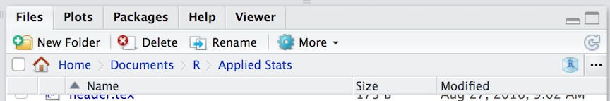
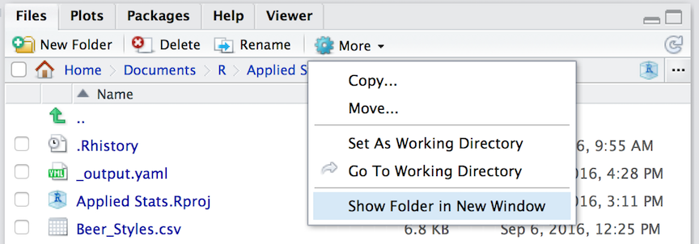

# Manipulating Data

> The *sine qua non* of of this course is instruction in how how to manipulate data.  In this class activity, we will focus on some built-in data sets to allow you to work in R and get more keyboard time in RStudio.  There will be a series of questions at the end of the lecture that will ask you to retrieve certain information from various data sets.


## Data Import & Export

Raw data is imported into R using `read.*` functions.  There are a wide variety of file formats available, most of which have a corresponding function (e.g., `read.csv()`, `read.delim()`, `read.dcf()`, etc.).  For our purposes, we will focus on using *comma separated* files (*.CSV) as they are the most readily available and can be read by almost all editors and spreadsheet functions.   

On the lecture webpage, there is a file named `iris.csv`.  Download this file and put it in the same directory as your RStudio session.  If you do not know where this is, you can find it by asking R to get its current working directory as: 

```{r}
getwd()
```

The same information is also printed across the top of the "Files" pane in the RStudio interface (though it starts from your 'home' directory instead of the top of the file path).

```{r echo=FALSE, dpi=144}

```

One way to easily open this location is to select the "Show Folder in New Window" menu item in the "More" menu on that same pane.  It will open the folder you are looking at in the file system as a new window for you, then you can drag and drop things into it.

```{r echo=FALSE, dpi=144}

```

Keep in mind that R is running in a specific location on your computer.  This working directory is where it looks for stuff if you do not give a complete file path (e.g., 'C:\\Users\...' or '/Users/...' on winblows and mac, respectively).  To load in a CSV file, we can use the function

```{r eval=FALSE}
data <- read.csv("file.csv")
```

where at a bare minimum, we need to have the name of the file (in the example above it was 'file.csv').  There are a lot of additional arguments you can pass to `read.csv()` including:  

- `header = TRUE`: Does the file have a header row that gives the variable names?
- `sep = ","`:   What is the column separator.  By default for CSV, it is a comma.
- `quote = "\""`:  Is there text that is quoted within the body of the document?
- `dec = "."`: What is the decimal character?
- `fill = TRUE`: Do you want to fill in the empty data cells or do all rows of data have the same amount of data.
- `comment.char = ""`:  Are there comments in the text?

Additional options are available if you look at the help file as:

```{r eval=FALSE}
?read.csv
```

Once you have read the file in (it will complain with an error message if it does not work), then you will have a `data.frame` object named `data` (from the example above, you should of course name it something more descriptive).

$\;$

\begin{mdframed}[style=MyFrame,frametitle={Activity 1: Loading in Data}]
On the website for this days activities there is a file at the bottom of the page named `iris.csv`.  Download this file and take a look at it (you can use Excel or whatever you like) so you have an idea of what you are hoping to load into your session.

Make sure to put it in the correct folder and then load it in using the command \texttt{read.csv()} function as outlined above.  Assign these data to a variable named \texttt{flowers} so we can use it later throughout this activity.
\end{mdframed}

```{r echo=FALSE}
flowers <- read.csv("data/iris.csv")
```

Saving materials in R is a bit easier.  If you are needing to export the file back into a CSV format then you can use `write.csv()` (see `?write.csv` for specifics and examples) and it will write the file as a text file.  However, if you are only working in R with that file, you can save it as an R object without translating it back and forth through a CSV file.  Using the example data from above, you could save the `data.frame` as an R data object using:

```{r eval=FALSE}
save( data, file="mydata.rda")
```

and it will save the object.  Next time you need it, you can load it in using:

```{r eval=FALSE}
load("mydata.rda")
```


## Diving Into Data

In this next section, we will walk through the example iris data set and highlight some of the ways that you can manipulate `data.frame` objects.  If you have loaded in the data set as outlined above, we should be able to get a first look at it using the `summary()` function.

```{r}
summary(flowers)
```

Each of the columns in the `data.frame` is named, the first four of which are numerical values and the last one is a species designation. 


## Factor & Character Data

Depending upon how you have set up your R session, the last column may be either a character type or a factor.  By default, some builds of R turn all string characters into factors (a behavior I do not like because there are a lot of data types that I load in that are best defined as non-factors).  

In this data set though, it is probably best if the `Species` column were really a factor and not just a character data type.  We will play with this data set a bit and we will use the `Species` as a defining category (i.e., a factor).  


```{r}
flowers$Species <- factor( flowers$Species )
summary(flowers)
```

Notice in the output above how the factor column is tabulated by a count of the number of observations whereas the summary of the character data is just lumped all together.  Also remember, if you do not specify the factors as `ordered=TRUE` then it will assume that they are categorical data without ordinal information.  In this case, there is no reason to assume that one of these species types is greater than or less than another one so these are unordered factors.  

Conversely, if you have imported some data and it was automatically interpreted as factors, you can change a factor back to a character type by using the `as.character()` function.  I find in my interactions with data, I use a lot more textual data than factors so I set the default up to not automatically translate it into factors, only doing so when I need to.

In the example above, I *replaced* the original column of data with the factor version, though you may not need to do that.  You can easily add another column of data to the `data.frame` giving it a new name.  In the example below, I take the `flowers$Species` column and make a new one named `Taxonomy` by pasting the genus of the flowers onto it.  

```{r}
flowers$Taxonomy <- paste( "Iris", flowers$Species )
summary(flowers)
```


$\;$
\begin{mdframed}[style=MyFrame,frametitle={Activity 2: Create An Additional Column}]
Add an additional column onto the \texttt{flowers} data.frame.  If your data were imported as a factor then make a character column.  If it was imported as a character, make a factor column.
\end{mdframed}

## Indexing

The normal workflow in R consists of loading data into your session, manipulating the data, and performing operations---statistical, summary, or graphical--on it (or some subset of it).  Each element in the `data.frame` is indexed by the row and column number.  The order of the columns is as shown or can be viewed using

```{r}
names(flowers)
```

So if we wanted to access the `Sepal.Width` of 3$^{rd}$ observation, we could use the numerical indices (where the "Sepal.Width" is the second name in this list):

```{r}
flowers[3,2]
```

or by accessing the 3$^{rd}$ element of the "Sepal.Width" vector.

```{r}
flowers$Sepal.Width[3]
```

If you pull observations from a `data.frame`, you either get a new `data.frame` (if you include more than one column) 

```{r}
df <- flowers[,c(2,3,5)]
class(df)
summary(df)
```

or a vector of data (if you only have one column or any subset of one column).

```{r}
sepal_width <- flowers$Sepal.Width
length(sepal_width)
class(sepal_width)
sepal_width
```

In addition to numerical values, you can also use logical statements to select subsets of your data.  Here is an example of all the data whose `flowers$Sepal.Width` is less than 3.0cm and those that have sepals as large or bigger than 3.0cm.

```{r}
small_sepals <- flowers[ flowers$Sepal.Width < 3.0, ]
big_sepals <- flowers[ flowers$Sepal.Width >= 3.0, ]
summary( small_sepals )
summary( big_sepals )
```

$\;$
\begin{mdframed}[style=MyFrame,frametitle={Activity 3: Indexing and Grabbing Subsets of Data}]
Pull out a subset of the \texttt{flowers} data that represents only those observations of the \emph{Iris setosa} whose sepal width are equal to or smaller than 3.2cm.
\end{mdframed}

There are two ways you can also merge `data.frame` objects.  You can add data onto the bottom of the `data.frame` by using the `rbind()` function (row-binding).  This *requires* that both `data.frame` objects have the same column names (and in the same order).  

```{r}
all_sepals <- rbind( small_sepals, big_sepals )
summary( all_sepals )
```

You can also merge together two `data.frames` that have a common column index.  This may be necessary for cases where you have different kinds of observations that need to be merged into a single `data.frame`.  


Here is an example where I have some data on my sampling sites 

```{r}
sites <- data.frame( Site=c("Olympia","Richmond"), 
                     Latitude=c(47.0379,37.5407), 
                     Longitude=c(122.9007,77.4360) )
sites
```

and another set of data that has some observations on samples taken from each site.  

```{r}
data <- data.frame( Site=c("Olympia","Olympia","Olympia","Richmond","Richmond"))
data$Measurement <- c(12,22,35,56,46)
data
```

If I wanted to merge these two `data.frame` objects into a single one, incorporating each of the columns of data in both, I would

```{r}
df <- merge( sites, data )
df
```

Here the `merge()` function looks for a column that has the same name in both `data.frame` objects.  In this case it was "Site".  It then uses that as an index to merge both together into a new object.


## Sorting & Ordering

The order in which rows of observations are in the `data.frame` is determined by their placement in the original file.  If you look at the data, it seems to be sorted by `flowers$Species` but nothing after that.  

```{r}
head(flowers)
```

You can sort the whole `data.frame` by asking for a copy of it with a specific order based upon the columns.  Here I will re-assign the `data.frame` but this time ordered by `flowers$Sepal.Length`.

```{r}
flowers <- flowers[ order(flowers$Sepal.Length), ]
head(flowers)
```

Note the row indices (the column on the far left), they indicate the original order in which the observations were put into the `data.frame`.  The smallest sepal length in the data set was originally the 14$^{th}$ observation.

You see from the example above that the addition of new columns to a `data.frame` result in them being put on the right-hand side `data.frame` (e.g., `flowers$Taxonomy` is the last column of the output).  If you want to rearrange the columns of the `data.frame`, you do so by manually re-arranging the indices on those columns.  For example, if I wanted to make the numerical data the last four columns instead of the first two, I would specify it as:

```{r}
flowers <- flowers[ , c(6,5,1,2,3,4) ]
summary(flowers)
```


## Manipulating Data

As we saw above, you can change data either in-place or by adding new columns (and you could also drop columns by reordering them and just not include all the columns in the column indices).  You can also perform operations on columns of data, again either in-place, as an additional column, or not connected at all with the `data.frame`.  To do it in-place, you simply re-assign the values after the calculation.  For example, here is how I would subtract the average "Sepal.Length" from all the observations.

```{r}
ave_sepal_length <- mean( flowers$Sepal.Length )
standardized_sepal_lengths <- flowers$Sepal.Length - ave_sepal_length
summary( standardized_sepal_lengths )
```

Which should have a mean of zero, right?

$\;$
\begin{mdframed}[style=MyFrame,frametitle={Activity 4: Manipulate Existing Data}]
Use the \texttt{flowers} data frame and translate the measurements from centimeters into millimeters.  Provide a summary of the output.
\end{mdframed}


## Tabulating 

We can finish up this exploration of the iris data set by doing some summaries.  One of the main strengths of R is that it is a functional language.  This may not mean much to you now, but in the long run you will find that you can perform opertions on large data sets by merging together cleaver use of indices and the application of one or more functions.  

Consider the case where we are trying to find the mean \texttt{Sepal.Length} for each of the three species.  Proceedurally, we must do the following general steps:  

1. Go through each row of the data and figure out which species we are looking at.
2. Add the length of this observation to a tally variable, one for each species.
3. Count how many observations of each species we have in the `data.frame`.
4. Divide the approporiate tally variable by the number of observations.
5. Return or print out the results.

Not a trivial thing to do.  If you were going to to this literally, you would have to set up three tally variables, three observation count variables, and then do a loop and run through all the observations making decisions on which observation is which and where to add the tally and count.

Fortunately for us, this is not that difficult of an issue in R for the following two reasons:  
1. We have a function `mean()` that estimates the mean of a set of variables.
2. We have a factor varaible in `flowers` that differentiates between species.

As such we can then ask R to estimate the mean in "Sepal.Length" by "Species" using

```{r}
mean_sepal_length <- by( flowers$Sepal.Length, flowers$Species, mean)
mean_sepal_length
```

If you read this literally, it says, "Wit Sepal Length, partition the data by Species and pass it to the function mean".  This shorthand is important in that it highlights the flexibility and utility of applying functions to our data.  With a few keystrokes, we can accomplish a lot of computational progress!

You could find these values by slicing as:

```{r}
# literally grab the mean of all sepal lengths WHERE species is identical to X
mean_setosa <- mean( flowers$Sepal.Length[ flowers$Species == "setosa" ] )
mean_versicolor <- mean( flowers$Sepal.Length[ flowers$Species == "versicolor" ] )
mean_virginica <- mean( flowers$Sepal.Length[ flowers$Species == "virginica" ] )
mean_sepal_lengths_long <- c(setosa=mean_setosa, versicolor=mean_versicolor, virginica=mean_virginica )
mean_sepal_lengths_long
```

But it sure does look like *a lot* more code to write!  In general, we should strive to keep our code as easy to understand as possible.  In the end, you will be reading your own code and you must be able to easily understand it at some random time in the future.  For this to happen, you really need to clear on what you are trying to do.

$\;$
\begin{mdframed}[style=MyFrame,frametitle={Activity 5: Manipulate Existing Data}]
Which species has less variation in sepal width, and which has the most?  [Hint: see ?sd]
\end{mdframed}

